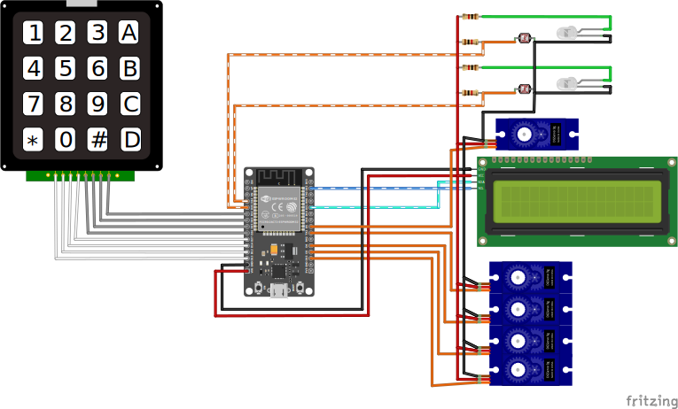
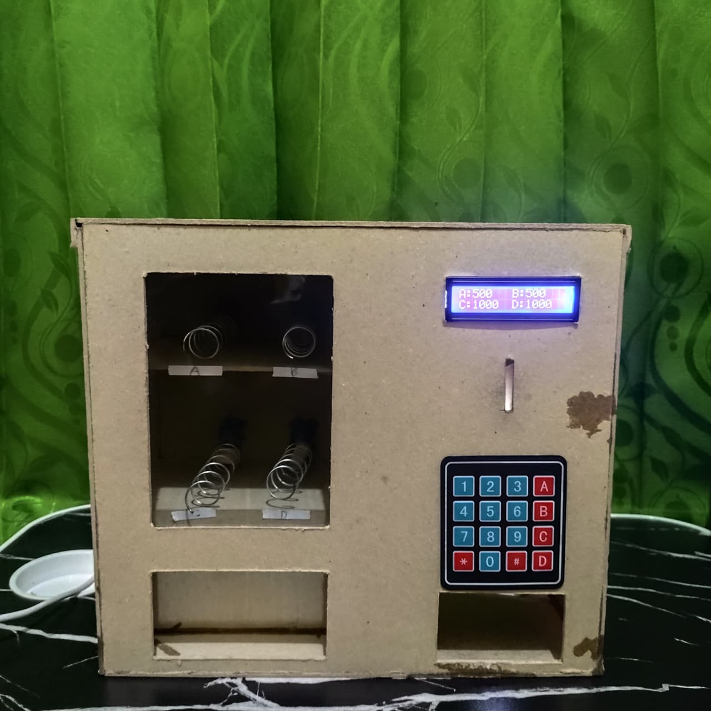
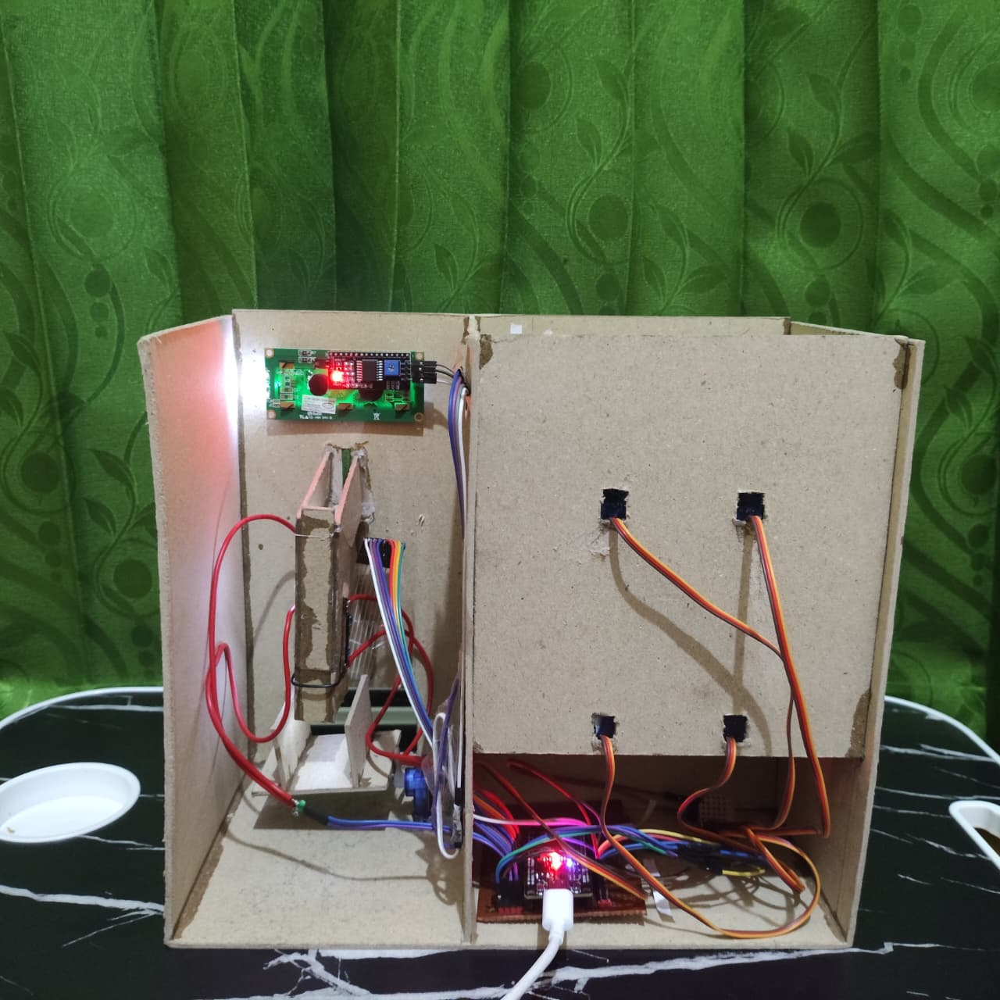
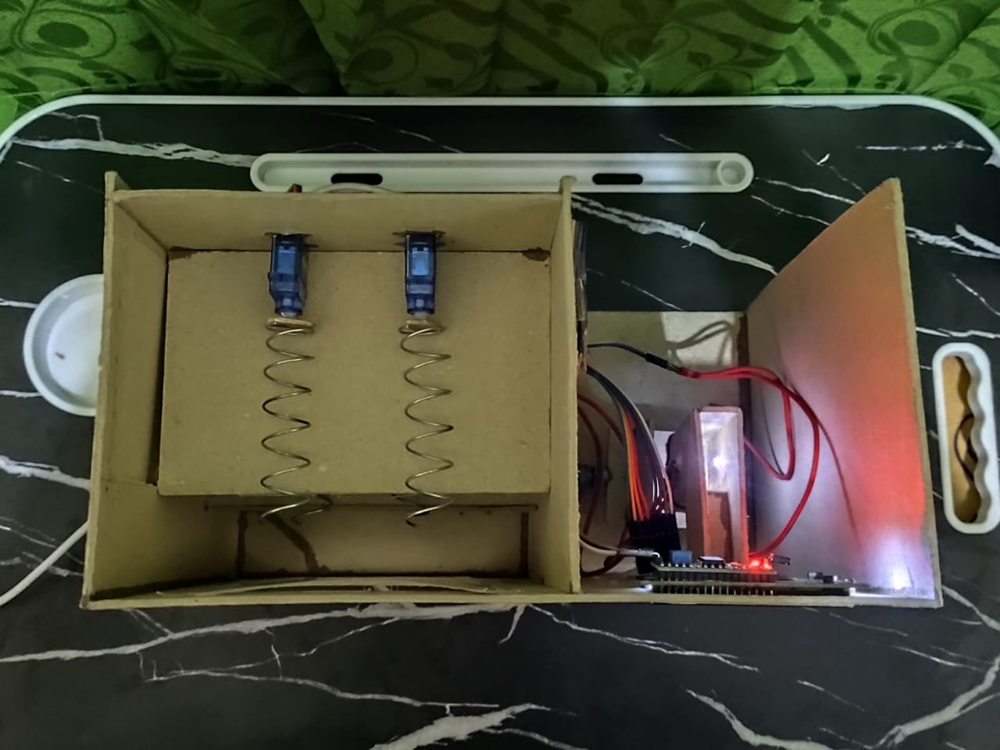

  
# **Mini Vending Machine**

**Nur Rohmat Sapto Utomo[*](#asal-instansi), Zaskia Khaira Kamila[*](#asal-instansi), Kian Taqwa Cahaya Pribadi[\*](#asal-instansi)** 
<small>
<a name="asal-instansi">*)</a> Program Studi Sarjana Terapan Teknik Listrik, Fakultas Vokasi, Universitas Negeri Surabaya

*Email*: [24091387037@mhs.unesa.ac.id](mailto:24091387037@mhs.unesa.ac.id), [24091387042@mhs.unesa.ac.id](mailto:24091387042@mhs.unesa.ac.id), [24091387047@mhs.unesa.ac.id](mailto:24091387047@mhs.unesa.ac.id)
</small>

---

## ABSTRAK

Perkembangan teknologi sistem tertanam mendorong terciptanya perangkat cerdas yang mampu beroperasi secara mandiri, seperti mesin penjual otomatis. Proyek ini merancang sebuah prototipe Mini Vending Machine sebagai media pembelajaran mikrokontroler yang bertujuan untuk mengintegrasikan sensor, pemrosesan data, dan aktuator dalam satu sistem kerja nyata. Sistem ini dibangun menggunakan kerangka berbahan yellowboard dengan pusat kendali mikrokontroler ESP32. Mekanisme validasi pembayaran memanfaatkan sensor LDR untuk mendeteksi nominal uang berdasarkan kecepatan jatuh koin, yang kemudian dipilah oleh motor servo tipe standar. Interaksi pengguna dilakukan melalui keypad untuk pemilihan produk, sementara motor servo continuous bertugas mengeluarkan barang saat saldo mencukupi. Data saldo disimpan secara permanen menggunakan fitur Non-Volatile Storage (NVS) pada ESP32. Hasil pengujian menunjukkan bahwa sistem mampu mendeteksi koin, memvalidasi transaksi, dan mengontrol aktuator mekanik secara real-time dan efisien tanpa bantuan operator.

**Kata Kunci**: *Mini Vending Machine, Mikrokontroler ESP32, Sensor LDR, Motor Servo*

## ABSTRACT

The development of embedded system technology has encouraged the creation of intelligent devices capable of operating independently, such as vending machines. This project designs a Mini Vending Machine prototype as a microcontroller learning medium, aiming to integrate sensors, data processing, and actuators into a single functional system. The system is constructed using a yellowboard framework with an ESP32 microcontroller as the main control unit. The payment validation mechanism utilizes LDR sensors to detect coin denominations based on falling speed, which are then sorted by a standard servo motor. User interaction is facilitated through a keypad for product selection, while a continuous servo motor dispenses the item when the balance is sufficient. Balance data is stored permanently using the Non-Volatile Storage (NVS) feature on the ESP32. Test results demonstrate that the system is capable of detecting coins, validating transactions, and controlling mechanical actuators efficiently in real-time without operator assistance.

**Keywords**: *Mini Vending Machine, ESP32 Microcontroller, LDR Sensor, Servo Motor*

---

## Pendahuluan

Perkembangan teknologi otomasi dan sistem tertanam (embedded system) semakin mendorong inovasi dalam pembuatan perangkat cerdas yang mampu beroperasi secara mandiri. Salah satu contoh perangkat yang banyak diterapkan pada lingkungan publik maupun komersial adalah vending machine atau mesin penjual otomatis. Mesin ini memanfaatkan integrasi antara sensor, mikrokontroler, dan aktuator untuk melakukan proses transaksi serta distribusi barang tanpa campur tangan operator manusia. Dalam konteks pembelajaran mikrokontroler, penerapan konsep vending machine menjadi studi kasus yang relevan karena mencakup berbagai aspek penting, seperti pembacaan sensor, pemrosesan data secara real-time, kontrol aktuator, manajemen data permanen, serta perancangan sistem mekanis. Oleh karena itu, proyek Mini Vending Machine ini dirancang sebagai bagian dari pelaksanaan UAS mata kuliah Mikrokontroler, dengan tujuan memberikan pengalaman praktik kepada mahasiswa dalam membangun sistem otomatis berbasis ESP32. Pada proyek ini, pendeteksian nominal uang dilakukan dengan sensor optik berbasis LDR menggunakan metode perhitungan kecepatan jatuh koin. Mekanisme pemilah koin (valid–invalid) dikendalikan menggunakan motor servo tipe 180 derajat, sedangkan pengeluaran produk menggunakan motor servo tipe continuous. Seluruh proses dikendalikan oleh mikrokontroler ESP32 yang juga menyimpan data saldo secara permanen menggunakan memori Non-Volatile Storage (NVS). Dengan demikian, proyek ini tidak hanya memperkenalkan konsep dasar mikrokontroler, tetapi juga mengintegrasikan konsep mekatronika dan otomasi dalam satu sistem kerja nyata.
    
## Tinjauan Pustaka
### Vending Machine
Mini Vending Machine adalah sistem penjualan produk secara otomatis yang memanfaatkan integrasi antara sensor, mikrokontroler, dan aktuator untuk mendeteksi pembayaran, memvalidasi transaksi, dan menjalankan mekanisme pengeluaran barang secara mandiri tanpa bantuan operator[[1]](#ref-1). Dalam sistem ini, prototipe dirancang untuk membaca input dari sensor koin, menghitung akumulasi saldo, dan mengaktifkan aktuator untuk menjatuhkan produk ketika nominal harga tercapai. Sistem kendali transaksi ini dirancang berbasis mikrokontroler sebagai pusat pengolah data untuk memastikan efisiensi dan konsistensi dalam setiap proses penjualan. Validasi pembayaran dilakukan secara real-time oleh unit kontrol dan eksekusi pengeluaran produk dijalankan secara otomatis melalui mekanisme elektromekanik. 

### ESP32
ESP32 adalah mikrokontroler penerus ESP8266 yang dilengkapi modul WiFi dan Bluetooth Low Energy, sehingga sangat mendukung aplikasi berbasis Internet of Things. Pada sistem vending machine, ESP32 berperan sebagai pusat pengolah perintah yang mengatur komunikasi data, mengendalikan perangkat pendukung, dan menyalurkan instruksi ke aktuator maupun modul tampilan untuk menjalankan proses vending secara otomatis[[3]](#ref-3).

### Servo
Motor servo adalah jenis motor DC yang dilengkapi dengan rangkaian kontrol internal, gear, serta potensiometer sebagai umpan balik untuk mengatur posisi poros motor secara presisi. Motor ini bekerja berdasarkan sinyal PWM (Pulse Width Modulation), di mana lebar pulsa menentukan sudut pergerakan motor[[4]](#ref-4).

### LDR (Light Dependent Resistor)
Light Dependent Resistor (LDR) atau fotoresistor adalah komponen elektronik yang nilai resistansinya berubah sesuai intensitas cahaya yang mengenainya. Ketika cahaya yang diterima meningkat, nilai hambatan LDR akan menurun sehingga arus listrik lebih mudah mengalir, sedangkan ketika cahaya berkurang resistansinya meningkat. LDR terbuat dari bahan semikonduktor yang sensitif terhadap cahaya, di mana foton yang diserap dapat membebaskan elektron sehingga mempengaruhi nilai resistansi. Komponen ini umum digunakan pada sistem otomatisasi berbasis cahaya, seperti pengendali lampu, karena kemampuannya merespons perubahan intensitas cahaya secara langsung[[2]](#ref-2).

## METODOLOGI
Metode penelitian yang diterapkan dalam pengembangan Mini Vending Machine ini adalah metode prototyping dengan pendekatan rekayasa sistem (system engineering). Pendekatan ini dipilih untuk memfasilitasi integrasi yang presisi antara konstruksi mekanik berbahan yellowboard dan sistem kendali elektronik berbasis mikrokontroler ESP32. Proses pengembangan dilakukan secara komprehensif mencakup perancangan perangkat keras (hardware) dan pengembangan perangkat lunak (software) yang berfokus pada kemampuan pemrosesan data secara mandiri (standalone) dan real-time. Langkah-langkah penelitian disusun secara sistematis guna meminimalisir kesalahan perakitan serta memastikan efisiensi sistem sebelum tahap implementasi akhir. Tahapan penelitian dibagi sebagai berikut:

### Perancangan Perangkat Sistem
Perancangan sistem Mini Vending Machine ini dilakukan melalui pendekatan integrasi antara desain mekanik berbahan dasar karton tebal (yellowboard) dengan sistem kendali elektronik berbasis mikrokontroler. Desain yang matang diperlukan sebagai rancangan untuk memastikan presisi dimensi alat dan efisiensi fungsionalitas komponen sebelum proses perakitan fisik dilakukan. Rancangan ini tidak hanya berfungsi sebagai panduan visual, tetapi juga sebagai langkah preventif untuk menghindari kesalahan fatal selama proses instalasi dan mempermudah proses pengecekan ulang (troubleshooting) apabila terjadi kendala teknis pada integrasi komponen. Dengan perencanaan yang terstruktur, penggabungan antara jalur lintasan mekanis koin yang presisi dengan logika pemrograman pada ESP32 dapat dilakukan secara efektif, sehingga menghasilkan sistem yang mampu beroperasi secara mandiri (standalone) dan memproses transaksi secara real-time tanpa campur tangan operator.

### Flowchart Mini Vending Machine
Flowchart yang dirancang bertujuan untuk menampilkan proses tahapan sistem secara beruntun yang berlangsung di dalam sistem secara menyeluruh. Adapun flowchart sistem pada Mini Vending Machine dapat dilihat pada gambar berikut:

<small>

***Gambar 1.** Flowchart*

</small>

### Perancangan Rangkaian Keseluruhan Mini Vending Machine
Perancangan sistem ini menggabungkan konstruksi mekanik berbahan yellowboard dengan sistem kendali elektronik berbasis mikrokontroler ESP32. Material yellowboard digunakan sebagai kerangka utama untuk membentuk bodi alat, partisi rak penyimpanan, serta jalur lintasan koin yang presisi agar dapat dideteksi oleh sensor. Sistem ini terintegrasi dengan komponen sensor LDR, LED, Motor Servo, LCD, dan Keypad. 
1. **Tahapan Pembuatan**
   - **Persiapan Alat dan Bahan**

      **Alat Kerja:**

      1.	Cutter untuk memotong pola yellowboard dan mika.
      2.	Penggaris Besi dan Pensil untuk mengukur pola agar presisi.
      3.	Lem Tembak untuk merekatkan jalur seluncur koin dan per pegas pada servo.
      4.	Solder untuk menyambung kabel pada sensor LDR dan LED.
      
      **Bahan Utama:**

      1.	Yellowboard sebagai bahan utama dinding, rak dan jalur seluncur koin.
      2.	Mika Transparan untuk jendela display produk.
      3.	Per pegas untuk mendorong setiap produk.
      4.	Super Glue untuk merekatkan yellowboard.
      5.	Engsel untuk pintu restock.
      6.	Lem Bakar Isi Ulang.
      7.	Selotip.
      8.	Komponen Elektronika (ESP32, Servo Continunous, Servo Standar, LDR, LED, LCD, Keypad, Kabel, Kabel Jumper, Pin Header, PCB Lobang)
   
   - **Pengerjaan Body & Panel Depan**
      
      **Pola Panel Depan:**

      1.	Potong yellowboard persegi panjang untuk wajah depan.
      2.	Buat lubang persegi besar di kiri untuk Jendela Produk.
      3.	Buat lubang persegi panjang kecil di kanan atas untuk LCD.
      4.	Buat lubang pipih vertikal di kanan tengah untuk Slot Koin.
      5.	Buat celah tipis di bawah slot koin untuk kabel Keypad.
      6.	Buat lubang persegi panjang kecil di bawah Keypad untuk keluarnya koin invalid.
      7.	Buat lubang besar di bawah untuk Pengambilan Produk.

      **Pola Dinding dan Sekat:**
      
      1.	Potong dinding kiri, kanan, atas, bawah, dan belakang secara utuh. 
      2.	Buat lubang persgi panjang vertikal di dinding kanan yang akan dijadikan pintu restock produk.
      3.	Potong sekat tengah vertikal (pemisah antara ruang produk dan ruang mesin).
      4.	Potong sekat horizontal untuk rak produk.

   - **Perakitan Mekanik Rak**

      **Pasang Servo Stok:**

      1.	Rekatkan ujung per pegas ke baling-baling (horn) Servo Continuous menggunakan lem tembak.
      2.	Lubangi dinding belakang rak produk seukuran kabel servo.
      3.	Pasang servo pada dinding tersebut sehingga per pegas menjulur ke depan arah display.
      
   - **Perakitan Mekanik Koin**

      **Jalur Seluncur Koin:**

      1.	Buat lintasan miring dari yellowboard di belakang lubang koin.
      
      **Pasang Sensor:**
      
      1.	Pada lintasan tersebut, buat lubang kecil berhadapan di sisi kiri dan kanan dinding lintasan.
      2.	Pasang LED di satu sisi dan LDR di sisi lainnya.
      
      **Pasang Servo Sortir:**

      1.	Di ujung bawah lintasan, pasang Servo Standar (180).
      2.	Tempelkan potongan yellowboard kecil pada baling-baling servo sebagai alas jatuhnya koin.
      
   - **Integrasi Elektronika & Wiring**
      
      **Pasang Komponen Panel:**

      1.	Pasang LCD pada lubangnya (dari sisi dalam).
      2.	Tempel Keypad di permukaan depan, masukkan kabel pitanya ke dalam.
      3.	Tempel Mika pada jendela produk (dari sisi dalam).
      
      **Sambungan Kabel (Wiring) ke ESP32:**
      
      1.	Hubungkan kabel Servo Stok, Servo Sortir, LCD, Keypad, dan Sensor LDR ke pin GPIO ESP32 sesuai codingan Anda.
      2.	Gunakan PCB Lubang untuk membagi jalur tegangan 5V (Vin) dan Ground (GND) karena servo butuh daya stabil.
      
      **Manajemen Kabel:**
      
      1.	Rapikan kabel menggunakan selotip agar tertata.
         
   - **Finishing & Penutupan**
      
      **Penyatuan Kerangka Utama:**
   
      1.	Rekatkan semua sisi dinding Samping, Atas, Bawah ke Panel Depan menggunakan super glue.
      2.	Pastikan Box kokoh dan siku.
      
2. **Alur Kerja Sistem Vending Machine**
   - **Inisialisasi**
      
      Sistem menggunakan ESP32 sebagai otak pemrosesan dengan input dari Keypad dan Sensor LDR, serta output ke Servo, LED, dan LCD.

   - **Deteksi Koin**

      Sensor LDR membaca koin yang masuk.
      1.	Jika Valid maka servo sortir bergerak ke arah penyimpanan, Saldo bertambah, setelah itu Saldo tampil di LCD.
      2.	Jika Invalid maka servo sortir bergerak ke arah sebaliknya dan koin dikembalikan ke pengguna.

   - **Transaksi**
      1. Pengguna menekan kode produk (A-D) di Keypad.
      2.	Pengguna menekan tombol # untuk memproses.

   - **Pengecekan Saldo**
      1.	Ketika saldo cukup maka servo stok berputar, produk keluar dan saldo berkurang.
      2.	Jika saldo kurang servo diam dan LCD akan menampilkan "Saldo Tidak Cukup".

<small>

***Gambar 2.** Wiring*

</small>

## Hasil dan Pembahasan
Perancangan dan pembangunan sistem Prototype Mini Vending Machine ini bertujuan untuk menyediakan simulasi alat penjualan otomatis yang bekerja secara mandiri (*standalone*) tanpa bergantung pada koneksi internet. Sistem ini mengintegrasikan input sensor (seperti tombol, sensor koin, atau sensor jarak), mikrokontroler sebagai pusat pemrosesan logika, serta motor servo sebagai aktuator mekanik untuk mengeluarkan barang. Sistem dirancang untuk merespons permintaan pengguna secara langsung (*real-time processing*) di perangkat itu sendiri, di mana motor akan bergerak otomatis untuk menjatuhkan produk segera setelah input yang valid dideteksi, memastikan mekanisme kerja yang presisi dan efisien.

| No |   Komponen yang Diuji    | Parameter Uji/Kondisi                                 | Hasil Pengujian                                                                                                                                                                          | Status   |
| -- |:------------------------:| ----------------------------------------------------- | ---------------------------------------------------------------------------------------------------------------------------------------------------------------------------------------- | -------- |
|  1 | Servo Stok               | Diberikan perintah putar saat item dipilih via Keypad | Servo berputar sesuai derajat yang ditentukan yaitu 360° untuk mendorong barang keluar.                                                                                                  | Berhasil |
|  2 | Keypad                   | Menekan tombol angka/kode barang (A-D)                | Mikrokontroler berhasil membaca input tombol yang ditekan dengan benar dan merespons dengan berputarnya Servo Stok yang dipilih                                                          | Berhasil |
|  3 | Sensor LDR dan LED Putih | Memasukkan koin ke celah sensor (menghalangi cahaya)  | Nilai resistansi LDR berubah (Gelap), mikrokontroler mendeteksi koin masuk dan menambah saldo.                                                                                           | Berhasil |
|  4 | Servo Pemisah            | LDR mendeteksi adanya koin yang lewat                 | 1.	Jika koin terbaca maka akan bergerak ke arah penyimpanan uang. (Valid) 2.	Jika koin tidak terbaca atau tidak di kenali maka servo akan bergerak ke arah keluar/mengembalikan koin | Berhasil |

Adapun program yang kami gunakan dapat dilihat pada [GitHub](https://github.com/Nurutomo/mini-vending-machine-kelompok-8)
 
Dokumen penelitian ini dapat dilihat pada [Google Drive](https://drive.google.com/drive/folders/1iMuwxh7y3Og4IQ_VsS2yOAs0AXQ-EPVr?usp=sharing)

<!-- 

   -->

<small>

***Gambar 3, 4, dan 5.** Tampilan Fisik Mini Vending Machine (secara berurutan Depan, Belakang, Atas)*

</small>

## Kesimpulan
Berdasarkan hasil perancangan dan pengujian, prototipe Mini Vending Machine ini berhasil dikembangkan sebagai sistem penjualan otomatis mandiri yang mengintegrasikan mikrokontroler ESP32 dengan komponen elektromekanik. Sistem terbukti mampu menjalankan fungsi utamanya dengan baik, mulai dari pendeteksian dan validasi koin menggunakan sensor LDR, penyimpanan data saldo melalui fitur Non-Volatile Storage (NVS), hingga eksekusi pengeluaran produk menggunakan motor servo berdasarkan input dari keypad. Pengujian menunjukkan bahwa seluruh mekanisme, termasuk pemilah koin valid atau invalid dan pendorong produk, beroperasi secara presisi dan real-time tanpa bantuan operator, sehingga alat ini efektif digunakan sebagai media pembelajaran implementatif dalam bidang sistem tertanam dan otomasi.

## Daftar Pustaka
<a name="ref-1">[1]</a> V. S. S. S. a. K. M. E. Murena, “Design of a Control System for a Vending Machin,” Procedia CIRP, vol. 91, p. 758–763, 2020. 

<a name="ref-2">[2]</a> S. Supatmi, “Pengaruh Sensor LDR terhadap Pengontrolan Lampu,” Majalah Ilmiah UNIKOM, vol. 8, p. 175–180, 2010. 

<a name="ref-3">[3]</a> Y. T. K. Y. a. B. J. R. M. Hamdani, “Automatic Toolbox Design with Smart Vending Machine Method Based on Internet of Things,” Civil Aviation Polytechnic of Surabaya, 2024. 

<a name="ref-4">[4]</a> A. H. a. S. Manan, “Pemanfaatan Motor Servo sebagai Penggerak CCTV untuk Melihat Alat-Alat Monitor dan Kondisi Pasien di Ruang ICU,” Gema Teknologi, vol. 17, p. 95–99, 2013. 
